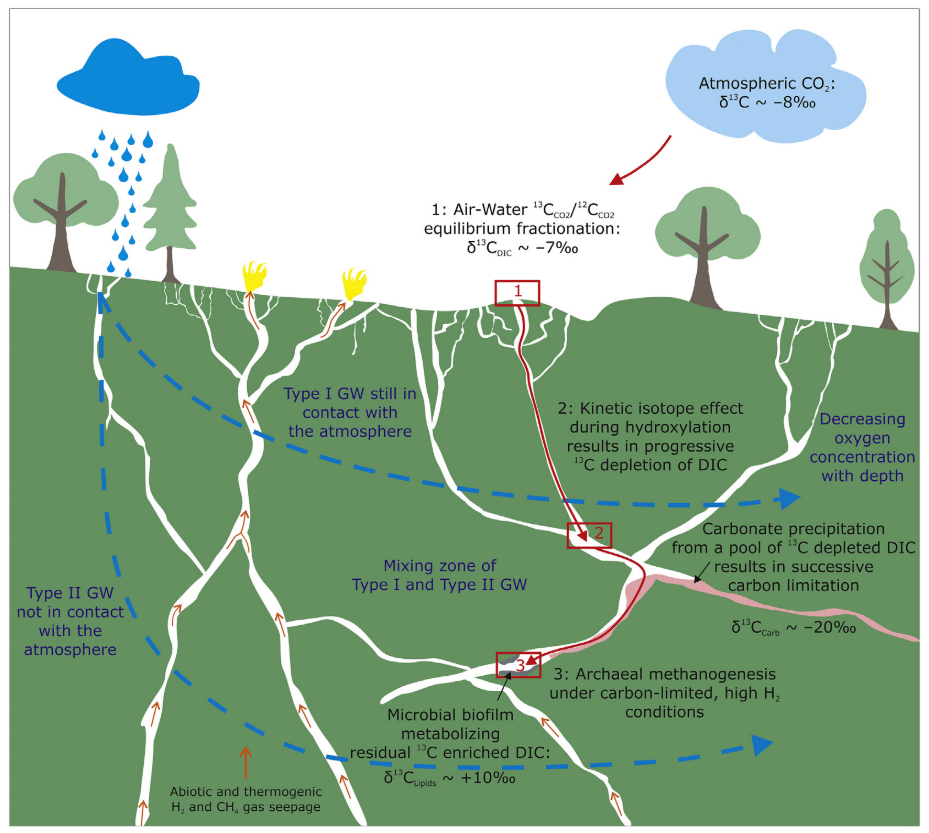
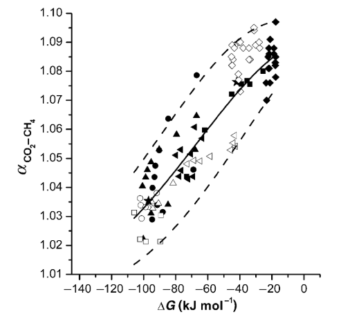
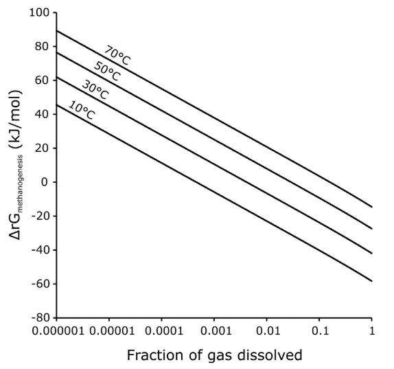

```{r "load packages", include=FALSE, message=FALSE}
library(tidyverse)
```


# Overview of Serpenitnized Environment

From last week, we know that within the deeper zones of a serpentinized system the carbon availability becomes limiting and the residual DIC $\delta^{13}C$ becomes highly enriched. Atmospheric $CO_2$ equiibrates with the surface fluid and begins to evolve into "Type I" groundwaters where KIE's of hydroxylation begin the inital depletion of DIC, then followed by mixing with "Type II" waters where carbonate precipitation that inherits the depleted $\delta^{13}C$ values results in a successively limited carbon source availbility but incredibly enirched $\delta^{13}C$ source for methanogens to use. 

```{r}

```

We're interested to see if we can tease out the energetics for methanogenesis within this system to see if it is favorable for methanogens in the subsurface serpentinized enrionment. We'll use reported and estimated isotopic values to calculate fractionation values and then relate that to a model that can potentially estimate $∆G$. Similarly, we can help evaluate the $\delta^{13}C$ values from a residual DIC pool that may be necessary to microbially produce enriched $\delta ^{13}CH_4$ values.


# Fractionation of CO2 and CH4

### Reported Values

The paper we discussed reports $\delta^{13}C_{CH_4}$ from a previous study (Etiope et al. 2011). We're going to use a fixed value in order to interpret the range of $\delta^{13}C_{CO_2}$ that may be availalable.

```{r}
delta_CH4 <- -0.012
```

### Estimating $\delta^{13}C$ of CO2

The same paper by Etiope et al. (2011) has reported $\delta^{13}C_{CO_2}$ values from gas generated from one of the seeps. However, our study reported $\delta^{13}C_{lipid}$ to inference the residual DIC available to methanogens may be extremely enriched. Here we'll use a sequence of values to see what values may be availbale and if they all fit into predicting energetic potentials. We're assuming the DIC values we are estimating are in the form of dissovled $CO_2$ for use by methanogens in our system.

```{r}
delta_CO2_reported <- seq(-0.018, -0.015, by = 0.001)
delta_CO2_est <- seq(-0.014, 0.012, by = 0.001) #Predicting values higher than the reported based off of the lipid-isotope values from Zwicker et al. (2018)
```

### Calculating the Fractionation Values for our methanogens

$$
\alpha_{{CO_2}-{CH_4}} = \frac{\delta_{CO_2} + 1}{\delta_{CH_4} + 1}
$$
**Please solve for this to include the reported and estimated $\delta^{13}C_{CO_2}$ values:**
```{r}
#Alpha values for reported and estimated conditions
alpha_CO2_CH4_reported <- tibble( 
  alpha_CO2_CH4 = #YOUR ANSWER,
  Scenario = "Reported")
alpha_CO2_CH4_est <- tibble(
  alpha_CO2_CH4 = #YOUR ANSWER),
  Scenario = "Estimated")

#Combine both for downstream use
alpha_CO2_CH4_df <- rbind(alpha_CO2_CH4_est, alpha_CO2_CH4_reported)
```


# The $\alpha - ∆G$ relationship

### Solving for $∆G$

Penning et al. (2005) reported the use of a $\alpha-∆G$ relationship that could be used to predict potential $∆G$ values in environmental samples where other environmental parameters are difficult to determine.
```{r}

```

Since we know our $\alpha_{{CO_2}-{CH_4}}$, we can then use our known values to "guess" our $∆G$ energetic potnetials for methanogens in this system. Remember, this is a first pass to just assess what might be feasible, and is not a direct correlation.

$$
\alpha_{{CO_2}-{CH_4}} = y_o + A\ \exp[-(∆G - x_c)^2 / 2w^2]
\\\
\\
y_o = 1 \\
A = 0.0919 \\
x_c = 11.8376\\
w = 78.0067
$$

**Solve for $∆G$:**
$$

$$


### Predicitng $∆G$

Let's now use our new equation and $\alpha_{{CO_2}-{CH_4}}$ values to see if we can predict the energetic favorability of methanogenesis.

**Plot the $\alpha - ∆G$ relationship and assess the estimated energetic availbility**

```{r}
alpha_CO2_CH4_df <- mutate(alpha_CO2_CH4_df,
  y_o = 1,
  A = 0.0919,
  x_c = 11.8376,
  w = 78.0067,
  delta_G = #YOUR ANSWER     #Need to account for ∆G which is negative when plotting the curve (Would your ∆G plot on the same axis scale as Penning et al. ?)
) 
```

**Did the equation solve for all values of $∆G$? What might this represent? (Plot this in the following chunks to better visualize)**

The Regression Line calculated from Penning et al. (2015) and the 95% confidence intervals for reference in plots
```{r}
reg_line_df <- tibble(
  y_o = 1,
  A = 0.0919,
  x_c = 11.8376,
  w = 78.0067,
  reg_line_values = seq(1.001, 1.09, by = 0.001),
  reg_line_equation = (sqrt((-2 * w^2) * log((reg_line_values - y_o) / A)) + x_c) * -1
)
reg_line_df2 <- tibble(
  y_o = 1,
  A = 0.1023,
  x_c = 35.3598,
  w = 92.1194,
  reg_line_values = seq(1.001, 1.09, by = 0.001),
  reg_line_equation = (sqrt((-2 * w^2) * log((reg_line_values - y_o) / A)) + x_c) * -1
)
gauss_line_df3 <- tibble(
  y_o = 1,
  A = 0.0815,
  x_c = -11.6846,
  w = 63.894,
  reg_line_values = seq(1.001, 1.09, by = 0.001),
  reg_line_equation = (sqrt((-2 * w^2) * log((reg_line_values - y_o) / A)) + x_c) * -1
)
```


```{r}
p1 <- ggplot() +
  geom_point(#YOUR ANSWER) +
  xlim(-250, 0) +
  ylim(1.00, 1.10) +
  geom_line(data = reg_line_df, aes(x = reg_line_equation, y = reg_line_values)) +
  geom_line(data = reg_line_df2, aes(x = reg_line_equation, y = reg_line_values), linetype =2) +
  geom_line(data = reg_line_df3, aes(x = reg_line_equation, y = reg_line_values), linetype = 2) +
  xlab("∆G") +
  ylab("alpha CO2-CH4") +
  theme_bw()
p1
```

**What might those values represent**

### Evaluating the $\alpha - ∆G$ relationship based on modeled values

Zwicker et al. (2019) did $∆G_{methanogenesis}$ calculations through model experiments based off of the amount of dissolved gasses ($CH_4$ and $H_2$). Let's assume that the methanogens of interest are operating in the lower extremes of the serpentinized system of around **30 degrees C** and **0.1 fraction** of gasses are dissolved in the hyperalkaline fluids.

**What can we gu-estimate our $∆G_{methanogenesis}$ to be? Let's now plot this against our previously estimated values:**

```{r}

```


**Plot Here:**
```{r}
alpha_CO2_CH4_df2 <- mutate(alpha_CO2_CH4_df,
  y_o = 1,
  A = 0.0919,
  x_c = 11.8376,
  w = 78.0067,
  delta_G = #YOUR ANSWER
) 

p2 <- ggplot() +
  geom_point(#YOUR ANSWER) +
  geom_point(#YOUR ANSWER) +
  xlim(-250, 0) +
  ylim(1.00, 1.10) +
  geom_line(data = reg_line_df, aes(x = reg_line_equation, y = reg_line_values)) +
  geom_line(data = reg_line_df2, aes(x = reg_line_equation, y = reg_line_values), linetype =2) +
  geom_line(data = reg_line_df3, aes(x = reg_line_equation, y = reg_line_values), linetype = 2) +
  xlab("∆G") +
  ylab("alpha CO2-CH4") +
  theme_bw()
p2
```


# Evaluating the $\alpha - ∆G$ relationship

We have different interpretations from strictly using the equation and including modeled $∆G_{methanogenesis}$ values.

**Is the $\alpha - ∆G$ relationship a reliable tool for the hyperalkaline serpentinized environment in the Chimaera Seeps?**


